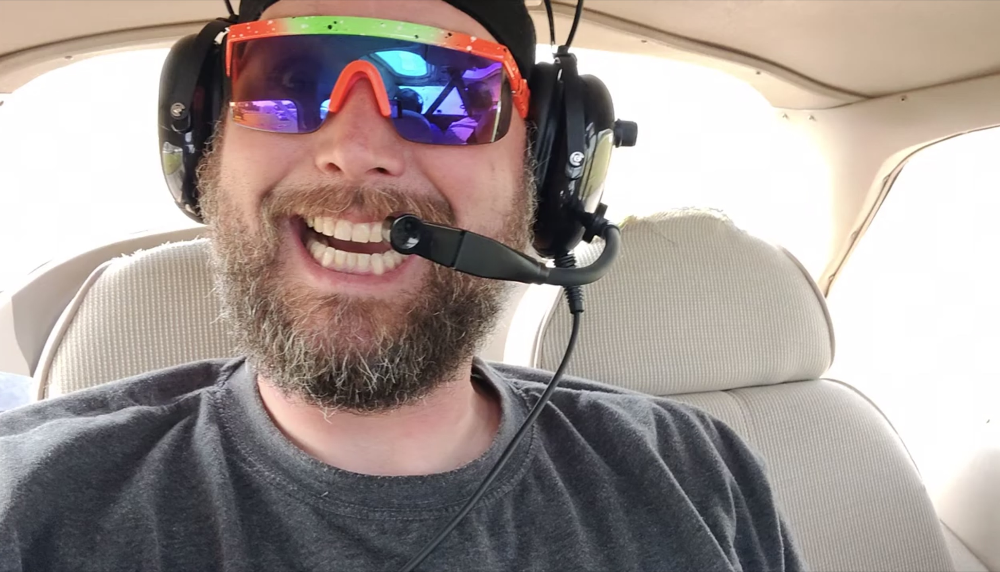

# In Loving Memory of Jacob Eugene Nichols

*November 12th, 1979 - January 10th, 2024*

At the age of 44, Jacob Eugene Nichols passed peacefully, leaving behind a symphony of memories that will forever resonate in the hearts of those who had the privilege of knowing him. Surrounded by the love of family and friends, Jacob faced his final battle of cancer with courage, grace, and an indomitable spirit.

Born on a chilly November day in 1979 to Lowell Eugene Nichols and Brenda Sue Young, Jacob brought warmth and joy into the lives of those around him. From the beginning, it was clear that this young man was destined for greatness. With an insatiable curiosity, Jacob had a natural knack for understanding the intricacies of life.

Professionally, Jacob embarked on a journey beneath the hoods of cars, proudly earning his stripes as an ASE certificated car mechanic at Blossom Chevrolet. Later, he embraced a new chapter in his life, working as a utility locator for USIC, where he continued to unravel the mysteries hidden beneath the earth's surface.

In matters of the heart, Jacob found his soulmate in Sasha Thorpe-Nichols, creating a love story that resonated with the melody of shared dreams, laughter, and adventures. Together, they navigated life's winding roads, proving that true love is a journey of a lifetime.

Jacob's spiritual journey was a significant aspect of his life. His unwavering faith in God, exemplified in passages such as John 3:16, provided him with strength and solace throughout his challenges. As Jake passed from this life, he knew it was just the beginning, echoing the promise that whoever believes in Jesus shall not perish but have eternal life. In his final moments, Jake was more concerned about everyone he left behind, expressing his deep love and care for them as he transitioned into eternal life. Now, reunited with his mother and God in heaven, Jacob's spirit continues to shine brightly, surrounded by the eternal love and peace that transcends earthly bounds. He spoke of the breathtaking colors only possible in heaven, marveling at the beauty that awaited those who would join him.

Jacob found solace and joy in the realm of creativity and nature. An aficionado of electronic music, he transformed beats and rhythms into a personal symphony that echoed the rhythm of his own heart. In moments of serenity, he would also strum the ukulele, weaving its melodic notes into the tapestry of his artistic expression. His love for nature, hiking, and cosplay showcased his vibrant spirit, painting the canvas of his life with vivid and diverse hues. Jacob was a beacon of joy, known for his infectious laughter and an uncanny ability to brighten even the darkest of days. His genuine desire to understand how things worked, coupled with a generous spirit, made him a cherished friend and confidant.

Survived by his loving spouse, Sasha Thorpe-Nichols, and step-son Noah Asante William Thorpe, Jacob leaves a legacy that extends beyond bloodlines. His parents, Lowell Eugene Nichols and Susan Marie Nichols, and brothers, Andrew Thomas Hooker, Jonathan Eugene Nichols, and Joseph Alan Nichols, mourn the loss of a son and brother who brought immeasurable love and laughter into their lives.

Jacob's last wishes were for everyone to have their own relationship with Jesus Christ, echoing the message of John 3:16. He expressed a deep desire to see every single one of you in heaven, sharing in the joy and beauty that awaited.

As we bid farewell to this extraordinary soul, let us remember Jacob not with tears, but with smiles, for his laughter lives on in the echoes of our shared memories. May his spirit find eternal peace and joy in the loving embrace of God, surrounded by friends and family in the heavenly realms.

A celebration of Jacob's remarkable life will be held once the weather warms up, date still to be determined. In honoring his memory, let us come together to share stories, laughter, and perhaps a dance or two, just as Jacob would have wished. Details will be shared with friends and family in a month or two. To ensure that you receive these details when they are ready, please [provide your contact information to his family](https://docs.google.com/forms/d/e/1FAIpQLSdGfF1exBj1-pyfR1NSZZ-LaijsG2gDjNFeX1x0ldiT0xNEkg/viewform?usp=sf_link).

Jake and Sasha             |  Jake can fly!
:-------------------------:|:-------------------------:
  |  
